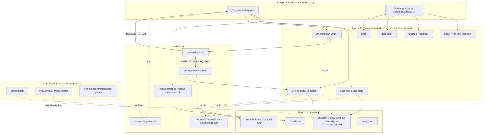

# Architecture

> GitNexus note: this repo is bash + markdown with no OOP call graph, so the knowledge-graph
> index reports 2,110 nodes / 2,102 edges but 0 clusters and 0 execution flows (community/process
> detection targets typed call graphs, not markdown-driven agent orchestration). The functional
> areas and flows below are derived from directory structure and `hooks/hooks.json`, not from
> GitNexus cluster/process output.

## Overview

VBW is a Claude Code plugin that adds a structured plan to execute to verify to UAT workflow on
top of Claude Code's slash-command and subagent primitives. It has no runtime process of its
own. Every "flow" is a markdown command file expanding into an LLM turn, which then spawns
specialized subagents (Scout, Architect, Lead, Dev, QA, Debugger, Docs) via the `Agent` tool.
State is persisted as files under `.vbw-planning/`, and 30 hook handlers (11 event types) wrap
every session/tool boundary to keep that state consistent.

## Functional Areas

| Area | Path | Role |
|---|---|---|
| Commands | `commands/*.md` (26) | Slash-command entry points (`/vbw:vibe`, `/vbw:plan`, `/vbw:qa`, ...). Each resolves the plugin root, computes phase state, and routes to a mode. |
| Agents | `templates/agent-roles/*.md.tpl` + `templates/agent-roles/defaults.json` (8) | Scout, Architect, Lead, Dev, QA Author, QA, Debugger, Docs, role prose templates with frontmatter rendered from the role defaults. Scout and QA are read-only (`permissionMode: plan`). |
| Hooks | `hooks/hooks.json` | 30 handlers across SessionStart, Stop, PreToolUse, PostToolUse, SubagentStart/Stop, Notification, PreCompact, TaskCompleted, TeammateIdle, UserPromptSubmit. All route through `scripts/hook-wrapper.sh`. |
| Scripts | `scripts/*.sh` (173) | State management, plugin-root resolution, context compilation, model routing, QA-gate logic, bootstrap/diagnostics. Bash 4.4+, `set -euo pipefail` on critical paths. |
| References | `references/*.md` | On-demand protocol docs loaded by commands (`execute-protocol.md`, `verification-protocol.md`, `subagent-contracts.md`, extracted `vibe-*` modules). |
| Templates | `templates/*.md` | Artifact templates (PLAN, SUMMARY, VERIFICATION, UAT, PROJECT, ROADMAP, REQUIREMENTS). |
| Config | `config/*.json` | `defaults.json`, `model-profiles.json`, `stack-mappings.json`, `token-budgets.json`, `rollout-stages.json`, `destructive-commands.txt`. |
| Testing | `testing/*.sh`, `tests/*.bats` | Contract verifiers (`verify-*.sh`) plus BATS behavior tests. `testing/run-all.sh` is the single entry point for tests and lint. |
| Docs | `docs/`, `README.md` | Consumer-facing documentation, kept in sync with behavior changes per CLAUDE.md convention. |

## Key Execution Flows

### 1. `/vbw:vibe` orchestration (the core loop)
`commands/vibe.md` resolves the plugin root and runs `scripts/phase-detect.sh` (or
`scripts/resolve-phase-state.sh`, extracted in the recent decomposition). It then routes to one
of Plan, Execute, Discuss, Verify, QA Remediation, UAT Remediation, Re-verify, Archive, or a
phase mutation mode. The route is chosen from deterministic state read from `.vbw-planning/`.

### 2. Plan to Execute to Verify pipeline
- **Plan**: `vbw-lead` (via `Task(vbw-dev)` fan-out for parallel research) turns a roadmap phase
  into a `PLAN.md` task list.
- **Execute**: `references/execute-protocol.md` spawns one `vbw-dev` per task, atomic commit per
  task, writes `SUMMARY.md` with any declared deviations.
- **Verify**: `vbw-qa` (read-only) checks the plan's must-haves and every declared deviation
  against the code, writing `VERIFICATION.md` with a PASS/FAIL/PARTIAL verdict per check.
- **Gate**: `scripts/qa-result-gate.sh` deterministically routes the verdict to
  `PROCEED_TO_UAT`, `REMEDIATION_REQUIRED`, or `QA_RERUN_REQUIRED`. No LLM judgment happens in
  the gate itself.

### 3. QA remediation loop
`scripts/qa-remediation-state.sh` runs a `plan -> execute -> verify` stage machine scoped to only
the FAIL rows from the prior `VERIFICATION.md`, writing round-numbered artifacts under
`remediation/qa/round-NN/` until the gate returns `PROCEED_TO_UAT`.

### 4. Hook-mediated session lifecycle
`hooks/hooks.json` calls `scripts/hook-wrapper.sh`. That wrapper resolves the plugin root via a
cache-first cascade and always exits 0. It then dispatches to the handler for the firing event.

- `session-start.sh`: bootstraps the plugin-root symlink and recovers state at session start.
- `compaction-instructions.sh` handles `PreCompact`, and `post-compact.sh` handles the
  `SessionStart` event whose matcher is `compact`. Together they snapshot and restore orchestrator
  state across context compaction.
- `PreToolUse` / `PostToolUse` handlers: guard destructive commands and track tool usage for
  metrics.

### 5. Model routing
`scripts/resolve-agent-model.sh` resolves each spawned agent's model in this order:
`model_overrides.<agent>`, then `model_matrix.<agent>.<effort>`, then the `model_profile` preset
from `config/model-profiles.json`, cross-checked against `scripts/detect-models.sh`'s 1h-cached
model catalog (binary-embedded table first, HTTP fallback last).

## Diagram

